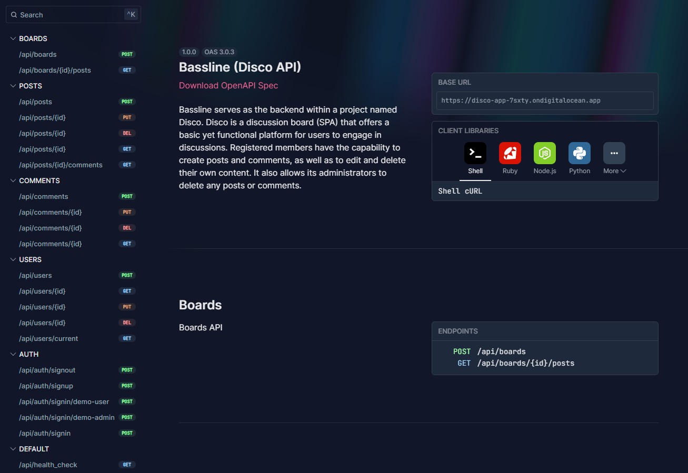
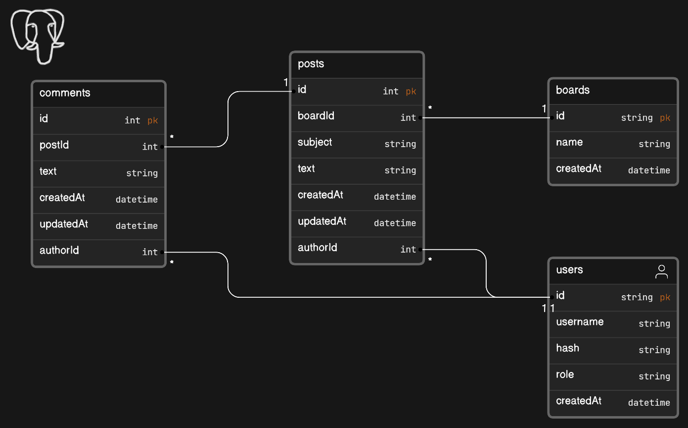

# Bassline (Disco API)

Bassline serves as the backend within a project named Disco. Disco is a
blog/discussion board (SPA) that offers a basic yet functional platform for
users to engage in discussions. Registered members have the capability to create
posts and comments, as well as to edit and delete their own content. It also
allows its administrators to delete any posts or comments.

## OpenAPI API Documentation

[OpenAPI Documentation](https://disco-app-7sxty.ondigitalocean.app/api/swagger)

## Disco Bassline Data Model

